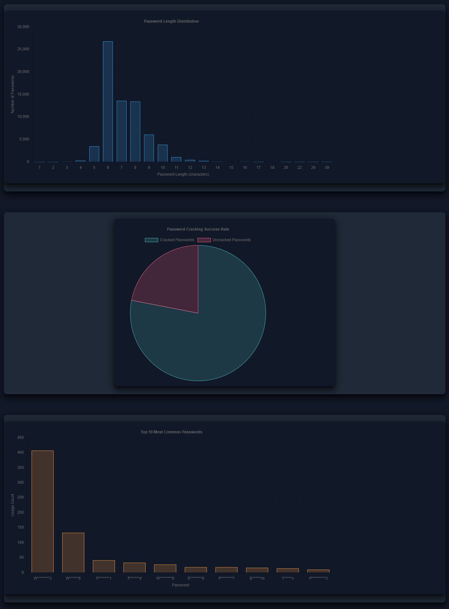

#  Domain Password Audit Tool (DPAT)

DPAT is a Python-based security tool that analyzes password hashes extracted from Active Directory domain controllers. It generates comprehensive HTML reports showing password usage statistics, policy violations, and security insights from both NTDS dumps and password cracking results.

### Sample Reports




## Features

- **Comprehensive Password Analysis**: Analyze password length distributions, reuse patterns, and policy violations
- **Interactive HTML Reports**: Generate detailed, clickable HTML reports with drill-down capabilities
- **Password History Support**: Analyze password history data when available
- **Group-Based Analysis**: Include group membership statistics for privileged accounts
- **Kerberoastable Account Analysis**: Identify and analyze cracked Kerberoastable service accounts
- **LM Hash Cracking**: Automatically attempt to crack NT hashes from partially cracked LM hashes
- **Data Sanitization**: Option to sanitize sensitive data in reports for sharing
- **Multiple Input Formats**: Support for Hashcat, John the Ripper, and other password cracking tools

## Requirements

- Python 3.8 or higher
- pycryptodome (for MD4 hash support)

## Installation

### Using pip
```bash
pip install pycryptodome
```

### Using Poetry
```bash
poetry install
```

## Quick Start

1. **Extract NTDS data** from your domain controller using secretsdump.py
2. **Crack passwords** using Hashcat, John the Ripper, or similar tools
3. **Run DPAT** to generate the analysis report

```bash
python dpat.py -n customer.ntds -c hashcat.potfile -p 8
```

## Usage

### Basic Command
```bash
python dpat.py -n <ntds_file> -c <cracked_file> -p <min_password_length>
```

### Required Parameters
- `-n, --ntdsfile`: NTDS file (output from secretsdump.py)
- `-c, --crackfile`: Password cracking output file (hashcat.potfile, john.pot, etc.)
- `-p, --minpasslen`: Minimum password length from domain policy

### Optional Parameters
- `-o, --outputfile`: HTML report filename (default: _DomainPasswordAuditReport.html)
- `-d, --reportdirectory`: Output directory (default: "DPAT Report")
- `-s, --sanitize`: Sanitize passwords and hashes in reports
- `-g, --groupsdirectory`: Directory containing group membership files
- `-m, --machineaccts`: Include machine accounts in analysis
- `-k, --krbtgt`: Include krbtgt account in analysis
- `-kz, --kerbfile`: File containing Kerberoastable accounts
- `-w, --writedb`: Write SQLite database to disk for inspection
- `--no-prompt`: Skip browser prompt (useful for automation)
- `-dbg, --debug`: Enable debug output

### Example Commands

**Basic analysis:**
```bash
python dpat.py -n customer.ntds -c hashcat.potfile -p 8
```

**With group analysis:**
```bash
python dpat.py -n customer.ntds -c hashcat.potfile -p 8 -g /path/to/groups
```

**Sanitized report:**
```bash
python dpat.py -n customer.ntds -c hashcat.potfile -p 8 -s
```

**With Kerberoastable accounts:**
```bash
python dpat.py -n customer.ntds -c hashcat.potfile -p 8 -kz kerberoastable.txt
```

## Input File Formats

### NTDS File Format
The NTDS file should be in the format output by secretsdump.py:
```
domain\username:RID:lmhash:nthash:::
```

### Cracked Password File Formats

**Hashcat format:**
```
nthash:password
lmhash:password
```

**John the Ripper format:**
```
$NT$nthash:password
$LM$lmhash:password
```

**Hex encoded passwords:**
```
nthash:$HEX[68656c6c6f]
```

### Group Files Format
Group membership files should contain one username per line:
```
domain\username
```

## Data Extraction

### Step 1: Extract NTDS Data
On a domain controller, create an IFM (Install From Media) backup:
```cmd
ntdsutil "ac in ntds" "ifm" "cr fu c:\temp" q q
```

This creates:
- `c:\temp\Active Directory\ntds.dit`
- `c:\temp\registry\SYSTEM`

### Step 2: Convert to DPAT Format
Use secretsdump.py to convert the backup:
```bash
secretsdump.py -system registry/SYSTEM -ntds "Active Directory/ntds.dit" LOCAL -outputfile customer
```

For password history (if available):
```bash
secretsdump.py -system registry/SYSTEM -ntds "Active Directory/ntds.dit" LOCAL -outputfile customer -history
```

### Step 3: Crack Passwords
**Using Hashcat:**
```bash
hashcat -m 1000 customer.ntds /path/to/wordlist
```

**Using John the Ripper:**
```bash
john --format=NT customer.ntds
```

## Report Sections

DPAT generates comprehensive reports including:

- **Password Statistics**: Total hashes, unique hashes, cracked passwords
- **Password Policy Violations**: Passwords shorter than policy minimum
- **Username/Password Matches**: Accounts using username as password
- **LM Hash Analysis**: Non-blank LM hashes and cracking statistics
- **Password Length Distribution**: Detailed length analysis with drill-down
- **Password Reuse**: Shared passwords across multiple accounts
- **Top Passwords**: Most commonly used passwords
- **Password History**: Historical password analysis (when available)
- **Group Statistics**: Privileged group analysis (when group files provided)
- **Kerberoastable Accounts**: Service account analysis (when provided)


## Sample Data

The repository includes sample data in the `sample_data/` directory for testing:
- `customer.ntds`: Sample NTDS file
- `oclHashcat.pot`: Sample cracked passwords
- `history/`: Sample data with password history

Test with sample data:
```bash
python dpat.py -n sample_data/customer.ntds -c sample_data/oclHashcat.pot -p 8
```

## Advanced Features

### Group Analysis
Create group membership files using PowerShell:
```powershell
Get-NetGroupMember -Recurse -GroupName "Domain Admins" > "Domain Admins.txt"
```

### Kerberoastable Account Analysis
Use CypherHound's parse-kerberoastable.py script to generate Kerberoastable account files for enhanced analysis.

### CypherHound Integration
You can plug files into DPAT generated by [CypherHound](https://github.com/fin3ss3g0d/cypherhound) in order to provide more statistics to DPAT reports. Currently, the extra statistics are:
- Group cracking statistics for every group in a given domain
- Cracked kerberoastable accounts

If you would like to utilize it for providing these extra statistics you will need to utilize the scripts here:
- [parse-memberships.py](https://github.com/fin3ss3g0d/cypherhound/tree/main#scriptsdpatparse-membershipspy). Pass the output directory to DPAT with the `-g` flag.
- [parse-kerberoastable.py](https://github.com/fin3ss3g0d/cypherhound/tree/main#scriptsdpatparse-kerberoastablepy). Pass the output file to DPAT with the `-kz` flag.

They are simple scripts with usage linked above and using them should be straightforward.

### Data Sanitization
Use the `-s` flag to create sanitized reports suitable for sharing:
```bash
python dpat.py -n customer.ntds -c hashcat.potfile -p 8 -s
```

## Troubleshooting

### Common Issues

**"No module named 'distutils'"**
- This is expected on Python 3.12+. DPAT handles this automatically.

**Empty reports**
- Verify your NTDS file format matches the expected format
- Check that your cracked password file contains matching hashes
- Ensure minimum password length parameter is correct

**Missing details links**
- Some report sections may not have detail pages if no data is found
- This is normal behavior for empty categories

### Debug Mode
Enable debug output for troubleshooting:
```bash
python dpat.py -n customer.ntds -c hashcat.potfile -p 8 -dbg
```

## Testing

Run the test suite:
```bash
python -m unittest tests.unit.test_core -v
python -m unittest tests.integration.test_integration -v
```

## Contributing

1. Fork the repository
2. Create a feature branch
3. Make your changes
4. Add tests for new functionality
5. Submit a pull request

## License

This project is licensed under the MIT License - see the LICENSE file for details.

## Credits

- **Carrie Roberts** - Original author
- **Dylan Evans** - Contributor

## Originally Sponsored by:

[](http://www.blackhillsinfosec.com)

## Support

For issues, questions, or contributions, please use the GitHub issue tracker.